# HR-Gold Product Plan

## Product Overview

**Name:** HR-Gold (working title)
**Target Market:** Vietnam initially, global extensible
**Domain:** HR Technology Platform
**Segments:** Working professionals + Education (students/fresh graduates)
**MVP Timeline:** 6 months

---

## Phase Roadmap

### Phase 1: Foundation (Month 1-2)
**Focus:** Core infrastructure + CV review tool

| Feature | Description |
|---------|-------------|
| CV Parser | Extract data from PDF/DOCX/Images |
| CV Template System | Beautiful, standardized CV builder |
| HR Dashboard | Review, score, filter candidates |
| User Auth | Login/register for HR and candidates |
| Candidate Profile | Create/edit searchable profile |

### Phase 2: Intelligence Assessment (Month 2-4)
**Focus:** Question banks + Games + AI evaluation

| Feature | Description |
|---------|-------------|
| Question Bank System | Categories, difficulty, tagging, segment (School/Work) |
| Cognitive Games - School | Aptitude tests for students/fresh grads |
| Cognitive Games - Work | Assessment for experienced professionals |
| Language Assessment - Vietnamese | Reading, writing, comprehension games |
| Language Assessment - English | TOEIC/IELTS-style games and quizzes |
| AI Scoring Engine | GPT/Gemini-based evaluation |
| Psychological Probing | Implicit questions to detect authenticity, reduce "perfect" mindset |
| Personality Tests | MBTI, Big Five assessments |
| Skill Assessments | Technical skill quizzes |

### Phase 3: Mock Interview (Month 3-5)
**Focus:** AI-powered interview platform

| Feature | Description |
|---------|-------------|
| Audio Interview | Voice-based AI interview |
| Video Interview | Webcam-based AI interview |
| Interview Questions - School | Entry-level, internship, graduate roles |
| Interview Questions - Work | Experienced, senior, management roles |
| Recording & Playback | Review past interviews |
| Feedback Reports | AI-generated interview feedback with authenticity scoring |
| Psychological Questions | Unobtrusive questions to reveal true personality vs. "performed" answers |
| Retry (Free) | Limited free attempts |
| Correction (Paid) | Pay to fix/correct answers after seeing mistakes |

### Phase 4: Job Platform (Month 4-6)
**Focus:** Job listing and matching

| Feature | Description |
|---------|-------------|
| Job Listings | Post/view jobs with filters |
| Company Profiles | Employer company pages |
| Smart Matching | AI candidate-job matching |
| Application System | Apply tracking pipeline |
| Search & Filter | Advanced candidate search |

### Phase 5: Data Marketplace (Month 5-6+)
**Focus:** Candidate profile monetization

| Feature | Description |
|---------|-------------|
| Profile Marketplace | Share/sell candidate profiles |
| Employer Access | Purchase candidate leads |
| Privacy Controls | Candidate consent management |
| Pricing Models | Subscription or per-profile |

### Future Phases (Post-MVP)
- Contract & insurance management
- Profit/sharing management
- Multi-language support
- Enterprise features (ATS, onboarding)
- School/College partnership portal
- University funding programs
- Student internship matching

---

## Technical Architecture

### High-Level Overview

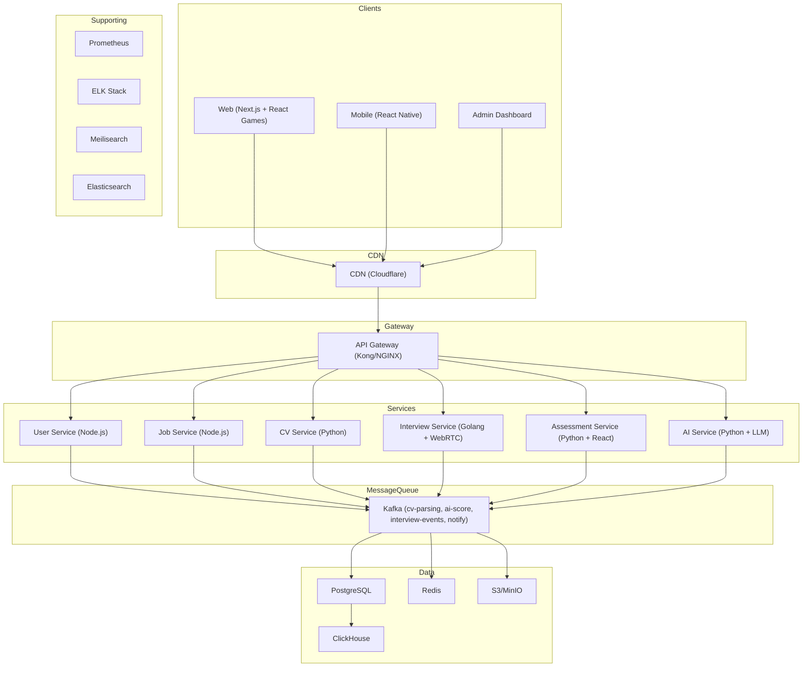

### Microservices Breakdown

| Service | Tech | Responsibility |
|----------|------|----------------|
| API Gateway | Kong / NGINX | Auth, routing, rate limit |
| User Service | Node.js + TS | Auth, profiles, roles |
| Job Service | Node.js + TS | Job CRUD, applications |
| CV Service | Python + FastAPI | CV parsing, storage |
| Assessment Service | Python + FastAPI | Games, quizzes, scoring |
| Interview Service | Golang + WebRTC | Video/audio calls, recording |
| AI Service | Python + FastAPI | GPT/Gemini integration |
| Notification Service | Node.js | Email, SMS, push notifications |
| Payment Service | Node.js | Subscriptions, transactions |
| Analytics Service | Python | Usage stats, reports |

### Service Communication

#### 1. Client to Gateway

```mermaid
flowchart TB
    subgraph Clients
        Web["Web (Next.js + React)"]
        Mobile["Mobile (React Native)"]
        Admin["Admin Dashboard"]
    end

    subgraph CDN
        CDN["CDN (Cloudflare)"]
    end

    subgraph Gateway
        API["API Gateway (Kong/NGINX)"]
    end

    Web --> CDN
    Mobile --> CDN
    Admin --> CDN
    CDN --> API
```

#### 2. API Gateway to Services (REST)

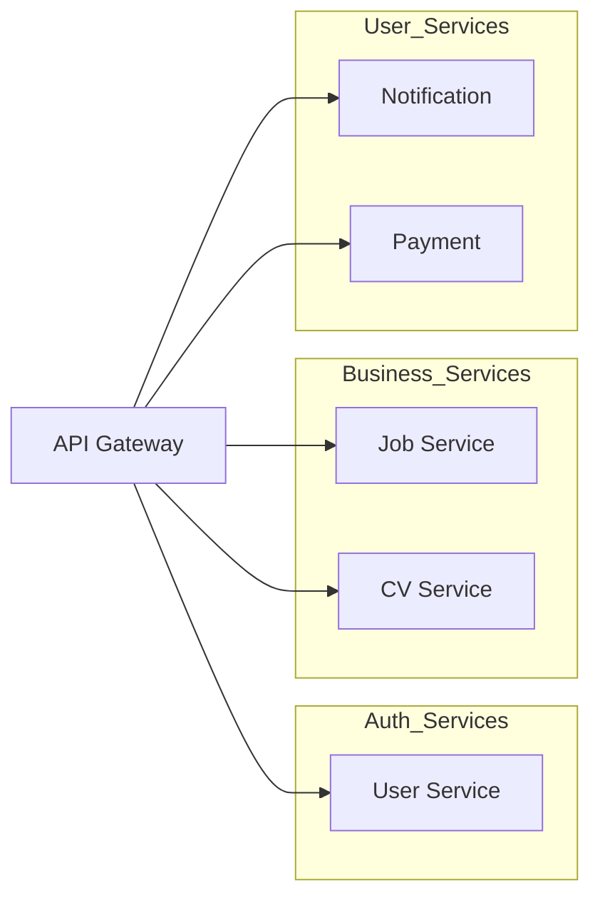

#### 3. Internal Service Communication (gRPC)

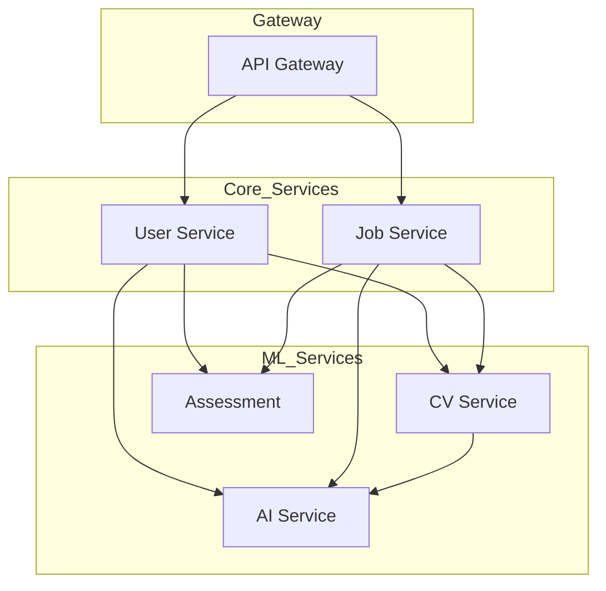

#### 4. Async Processing (Kafka)

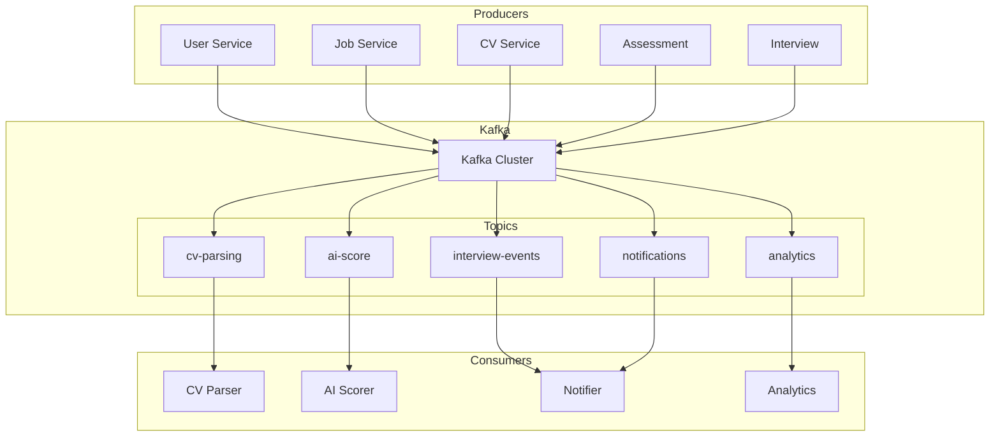

#### 5. Service to Data Stores

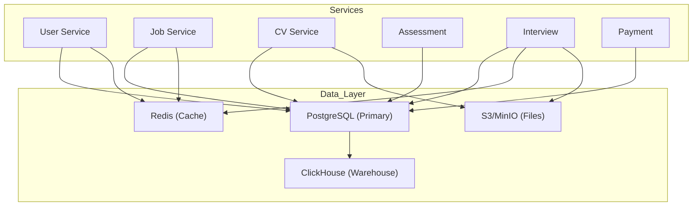

#### 6. Real-time Communication (WebSocket)

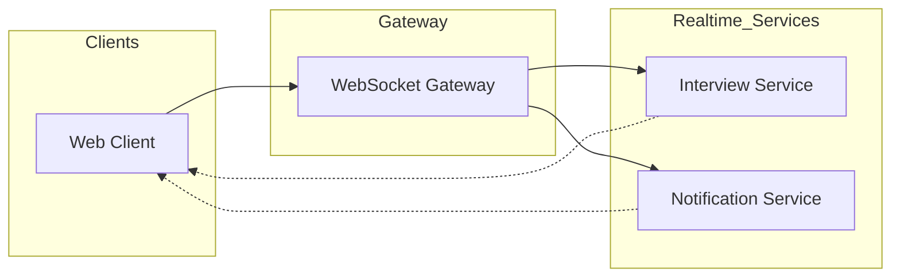

### Database Schema

#### 1. Core User & Profile

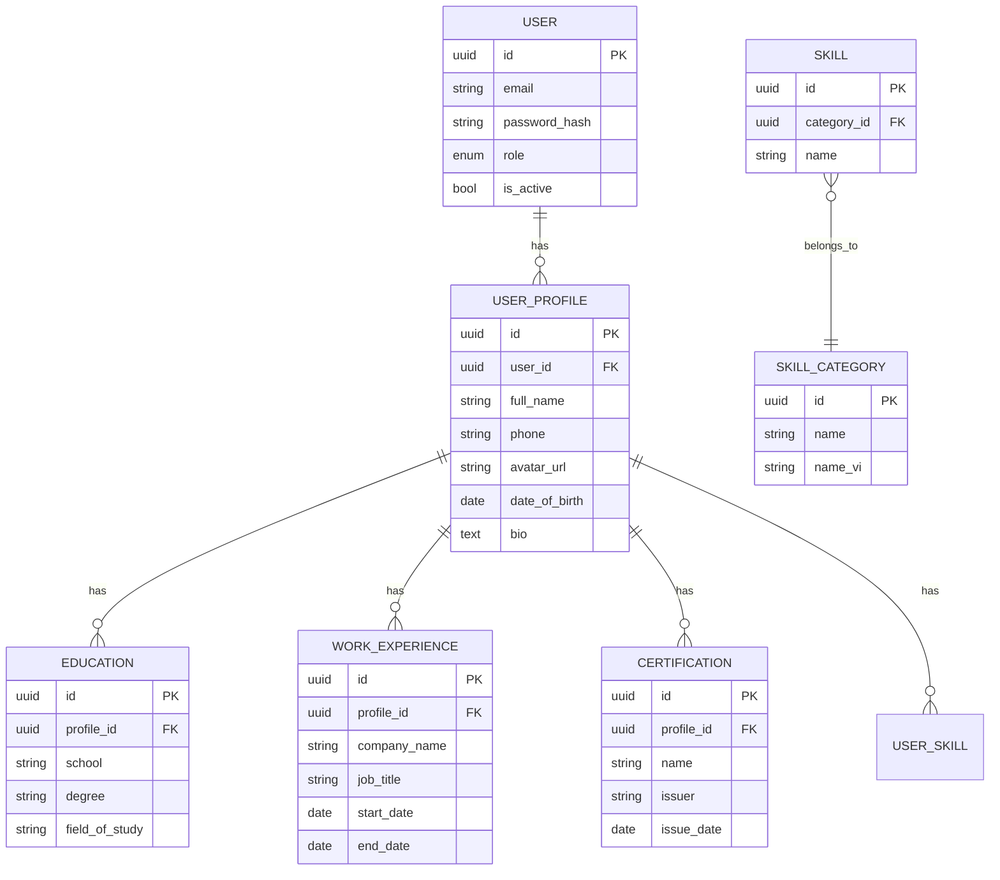

#### 2. Company & Jobs

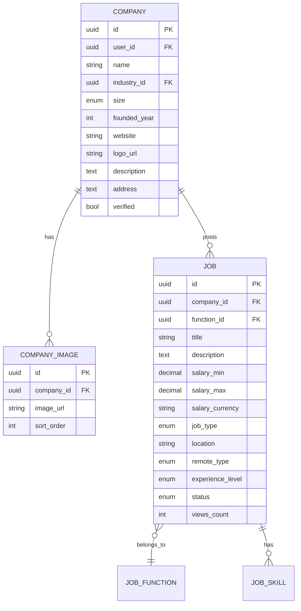

> Note: JOB_INDUSTRY, SKILL_CATEGORY, SKILL reference tables in Diagram #11

#### 3. Applications

#### 3. Applications

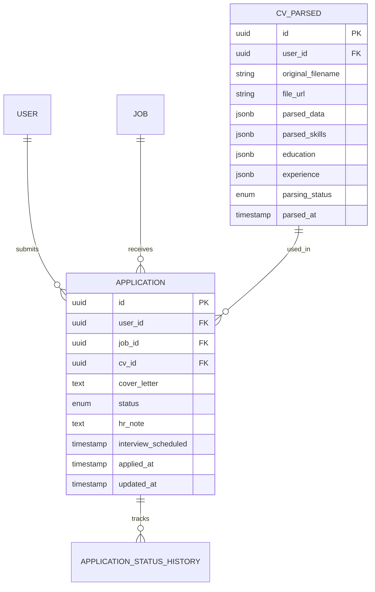

#### 4. Assessments & Games

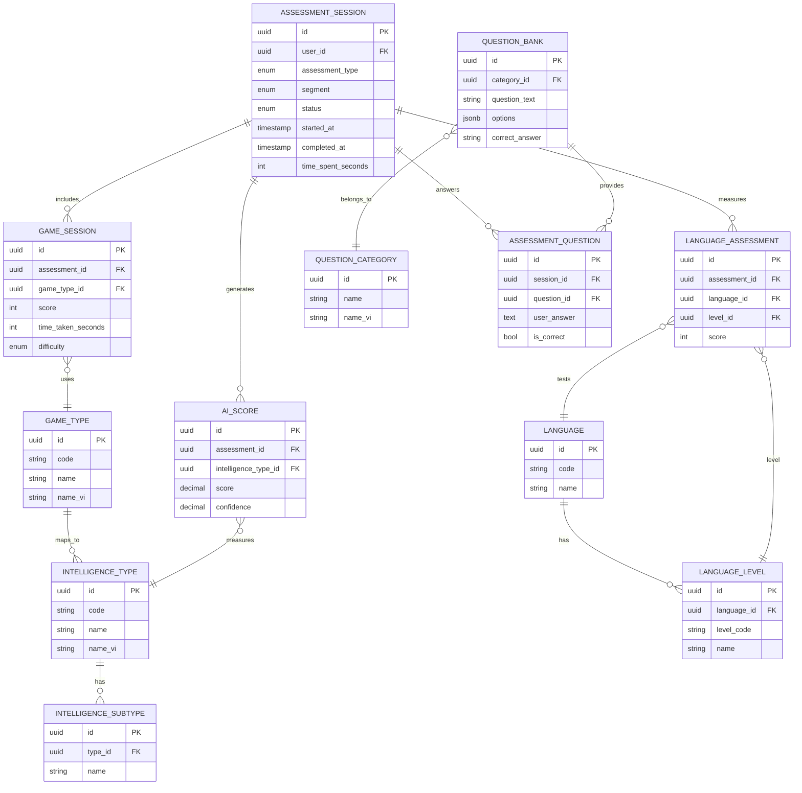

#### 5. Interviews

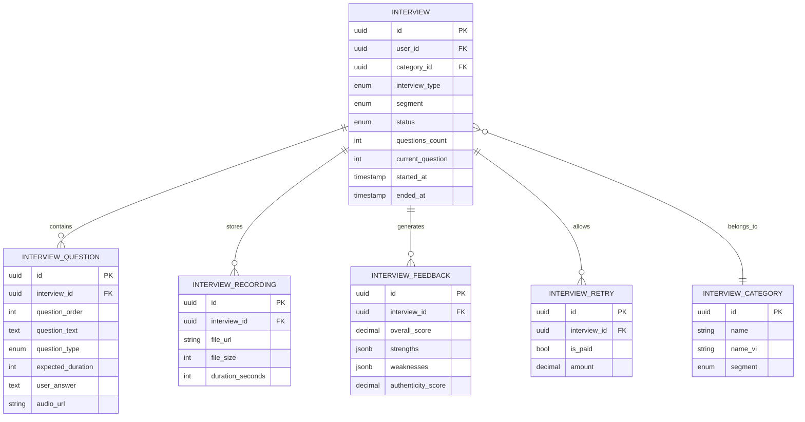

#### 6. Candidate Marketplace

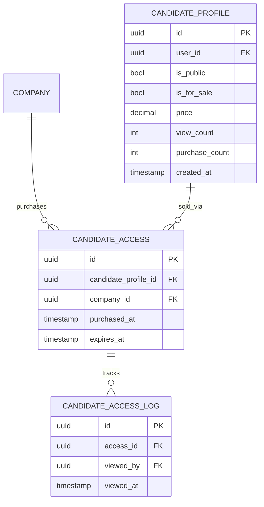

#### 7. Payments & Subscriptions

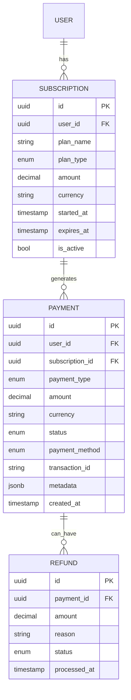

#### 8. Notifications & Auth

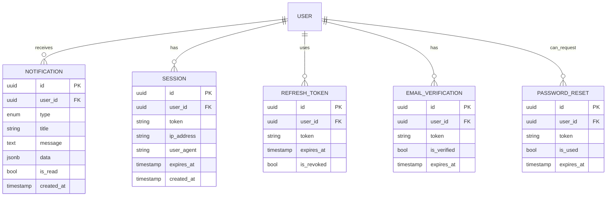

#### 9. Analytics & Logs

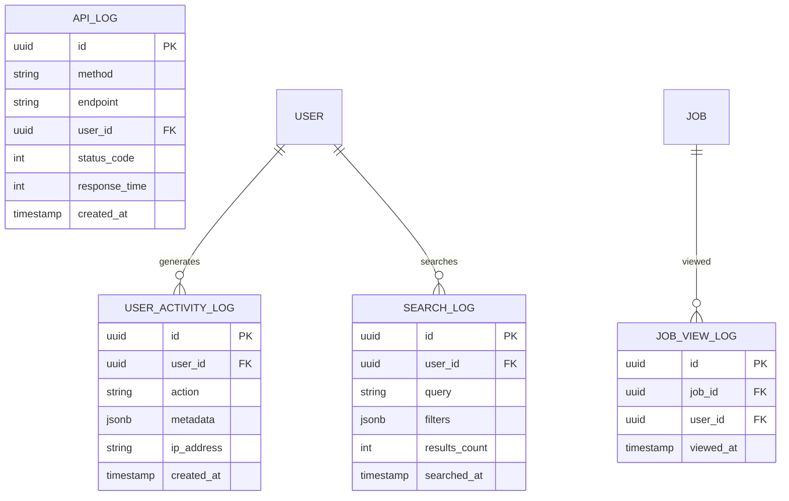

#### 10. Many-to-Many Mappings

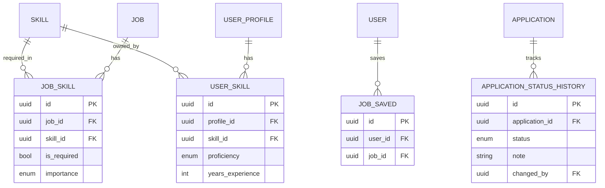

#### 11. Reference Data (Master Tables)

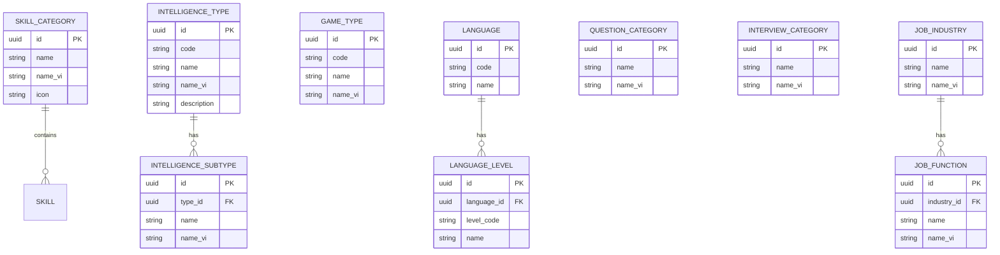

> **Note:** QUESTION_BANK defined in Diagram #4 (Assessments)

#### 12. Database Overview (All Tables)

| # | Table Name | Description |
|---|------------|-------------|
| 1 | USER | Main user accounts |
| 2 | USER_PROFILE | Extended profile info |
| 3 | EDUCATION | Education history |
| 4 | WORK_EXPERIENCE | Work history |
| 5 | CERTIFICATION | Certifications |
| 6 | USER_SKILL | User skills (junction) |
| 7 | COMPANY | Employer companies |
| 8 | COMPANY_IMAGE | Company images |
| 9 | JOB | Job listings |
| 10 | JOB_SKILL | Job required skills (junction) |
| 11 | JOB_SAVED | Saved jobs (junction) |
| 12 | APPLICATION | Job applications |
| 13 | APPLICATION_STATUS_HISTORY | Application audit trail |
| 14 | CV_PARSED | Parsed CV data |
| 15 | ASSESSMENT_SESSION | Assessment sessions |
| 16 | GAME_SESSION | Game results |
| 17 | LANGUAGE_ASSESSMENT | Language test results |
| 18 | AI_SCORE | AI evaluation scores |
| 19 | ASSESSMENT_QUESTION | Assessment questions |
| 20 | INTERVIEW | Interview sessions |
| 21 | INTERVIEW_QUESTION | Interview questions |
| 22 | INTERVIEW_RECORDING | Interview recordings |
| 23 | INTERVIEW_FEEDBACK | Interview feedback |
| 24 | INTERVIEW_RETRY | Retry records |
| 25 | CANDIDATE_PROFILE | Public candidate profiles |
| 26 | CANDIDATE_ACCESS | Purchased profile access |
| 27 | CANDIDATE_ACCESS_LOG | Access logs |
| 28 | SUBSCRIPTION | User subscriptions |
| 29 | PAYMENT | Payment transactions |
| 30 | REFUND | Refunds |
| 31 | NOTIFICATION | User notifications |
| 32 | SESSION | Active sessions |
| 33 | REFRESH_TOKEN | JWT refresh tokens |
| 34 | EMAIL_VERIFICATION | Email verification |
| 35 | PASSWORD_RESET | Password reset tokens |
| 36 | USER_ACTIVITY_LOG | Activity logs |
| 37 | JOB_VIEW_LOG | Job view logs |
| 38 | SEARCH_LOG | Search logs |
| 39 | API_LOG | API logs |
| 40 | SKILL_CATEGORY | Skill categories |
| 41 | SKILL | Skills |
| 42 | INTELLIGENCE_TYPE | Intelligence types |
| 43 | INTELLIGENCE_SUBTYPE | Intelligence subtypes |
| 44 | GAME_TYPE | Game types |
| 45 | LANGUAGE | Languages |
| 46 | LANGUAGE_LEVEL | Language levels |
| 47 | QUESTION_CATEGORY | Question categories |
| 48 | INTERVIEW_CATEGORY | Interview categories |
| 49 | JOB_INDUSTRY | Job industries |
| 50 | JOB_FUNCTION | Job functions |

Total: **50 tables** (27 entity tables + 23 reference tables)

### Tech Stack Recommendation

| Layer | Technology | Reason |
|-------|------------|--------|
| Frontend Web | Next.js 14+ + React | SEO, SSR, dashboard, games |
| Frontend Mobile | React Native / Flutter | Cross-platform apps |
| Backend API (General) | Node.js + TypeScript | Fast iteration, shared team |
| Backend API (Video) | Golang | High performance, WebRTC |
| Data/ML Pipeline | Python (FastAPI) | CV parsing, AI scoring, analytics |
| Database | PostgreSQL | Relational data |
| Data Warehouse | ClickHouse / BigQuery | Analytics, candidate data |
| Cache & Pub/Sub | Redis | Sessions, caching, real-time updates |
| File Storage | AWS S3 / MinIO | CVs, recordings |
| AI Integration | OpenAI + Gemini | Flexible, cost-effective |
| Auth | NextAuth.js / custom | JWT + social login |
| Search | Meilisearch / Elasticsearch | Full-text search |
| Video/Audio | Golang + MediaMTX / LiveKit | Real-time interviews |
| Message Queue | Apache Kafka | Event streaming, async processing |
| Container | Docker + Kubernetes | Orchestration |

### Data Models (High-Level)

```
Candidate
├── profile (name, email, phone, location)
├── cv (parsed data, raw file)
├── assessments (game scores, test results)
├── interviews (recordings, feedback)
├── applications (jobs applied)
└── visibility (public/private, for sale)

Job
├── company (name, logo, description)
├── details (title, salary, location, type)
├── requirements (skills, experience)
├── pipeline (applications, stages)
└── status (active/closed)

Company
├── profile (name, industry, size)
├── jobs (active listings)
├── candidates (purchased/viewed)
└── subscription (plan, limits)
```

---

## MVP Feature Details

### 1. CV Review Tool (Phase 1)
- Upload CV (PDF, DOCX, image)
- Auto-parse: contact info, education, experience, skills
- HR dashboard to view, annotate, score candidates
- Export to standardized format

### 2. Question Bank & Games (Phase 2)
- **Games:** Memory match, pattern recognition, math puzzles
- **Questions:** Technical, behavioral, situational
- **AI Scoring:** Combine game results + answers → intelligence score
- Results saved to candidate profile

### 3. Mock Interview (Phase 3)
- **Audio:** Phone-style interview with AI voice
- **Video:** Face-to-face with avatar/AI avatar
- Real-time speech-to-text, sentiment analysis
- Post-interview: AI feedback report with scores
- Recording storage for review

### 4. Job Listing Platform (Phase 4)
- Employers post jobs with rich details
- Candidates search and filter
- One-click apply with profile
- Application tracking (applied → reviewed → interview → offer)

### 5. Candidate Marketplace (Phase 5)
- Candidates opt-in to share profile
- Employers browse/search candidate database
- Purchase lead (contact info + profile)
- Revenue share with candidate

---

## Team Structure (6 Devs)

| Role | Count | Focus |
|------|-------|-------|
| Full-stack Lead | 1 | Architecture, code review |
| Frontend Dev | 2 | Web + Mobile UI |
| Backend Dev | 2 | API, AI integration, DB |
| DevOps/QA | 1 | CI/CD, testing, deployment |

### Development Approach
- **Sprint:** 2-week sprints
- **Methodology:** Agile with light documentation
- **Code Review:** Required for all PRs
- **Testing:** Unit tests + manual QA

---

## Budget Allocation (100M VND / ~6 months)

| Category | Estimated Cost | Notes |
|----------|----------------|-------|
| Cloud (AWS/Vercel) | 30-40M | Hosting, storage, compute |
| AI APIs (GPT/Gemini) | 20-30M | Interview, scoring, parsing |
| Domain & SSL | 5M | .com, .vn domains |
| Third-party tools | 10M | Email, SMS, analytics |
| Marketing (2 people) | 20-30M | Content, ads, SEO |
| Contingency | 10-15M | Unforeseen costs |

---

## Key Success Metrics

| Metric | Target (MVP) |
|--------|--------------|
| Registered Candidates | 5,000+ |
| Registered Employers | 100+ |
| CVs Processed | 3,000+ |
| Interviews Conducted | 500+ |
| Jobs Posted | 200+ |
| Monthly Active Users | 1,000+ |

---

## Risks & Mitigations

| Risk | Mitigation |
|------|------------|
| AI cost too high | Optimize prompts, cache responses, use cheaper models for simple tasks |
| Slow candidate adoption | Partner with universities, free CV parsing |
| Employer hesitation | Free trials, case studies, success stories |
| Tech complexity (video) | Use LiveKit/Twilio, start with audio-first |
| Compliance (data privacy) | GDPR-compliant design, clear consent flows |

---

## Next Steps

1. **Week 1-2:** Finalize feature priorities, design system
2. **Week 3:** Setup development environment, CI/CD
3. **Week 4:** Start Phase 1 - Auth + CV parser
4. **Ongoing:** Bi-weekly demos to stakeholders

---

*Document Version: 1.0*
*Last Updated: May 2026*