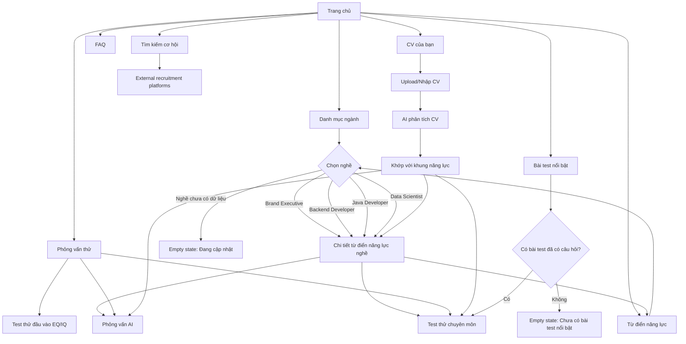

# UI Flow Specification

## 1. Executive Summary

**Quan sát từ file:** File mô tả cấu trúc UI cho một nền tảng hỗ trợ ứng viên gồm các khu vực chính: **Trang chủ**, **Từ điển năng lực**, **Phỏng vấn thử**, **FAQ**, và **CV của bạn**. Trang chủ có các phần: giới thiệu, danh mục ngành/nghề, bài test nổi bật và tìm kiếm cơ hội. Từ điển năng lực lặp lại danh mục ngành/nghề. Phỏng vấn thử gồm test đầu vào EQ/IQ, test chuyên môn và phỏng vấn AI. CV của bạn có tính năng phân tích CV bằng AI và khớp với khung năng lực.

**Suy luận:** Đây là UI flow cho sản phẩm Mockbros hoặc một nền tảng tương tự, giúp ứng viên chọn ngành/nghề, xem từ điển năng lực theo nghề, luyện test/phỏng vấn và phân tích CV theo khung năng lực.

**Ghi chú quan trọng từ người dùng:** Trong danh mục ngành, hiện đã có nội dung chi tiết khi nhấn vào các nghề: **Brand Executive**, **Backend Developer**, **Java Developer**, và **Data Scientist**. Các nghề còn lại chưa có nội dung chi tiết. Khi làm UI cho **Danh mục ngành**, cần có dòng chú thích ngay bên dưới: **“Đã có từ điển năng lực cho nghề”**.

---

## 2. Workbook Analysis

| Sheet                                            | Vai trò của sheet                      | Nội dung chính                                                                                                      | Mức độ chắc chắn |
| ------------------------------------------------ | -------------------------------------- | ------------------------------------------------------------------------------------------------------------------- | ---------------- |
| Cấu trúc thiết kế UI.csv                         | Sheet cấu trúc tổng quan UI/navigation | Liệt kê các trang chính, section trong từng trang, danh mục ngành, danh sách nghề, test/phỏng vấn, FAQ, CV analysis | Cao              |
| Cấu trúc thiết kế UI.csv - nhóm Trang chủ        | Mô tả homepage                         | Header navigation, giới thiệu, danh mục ngành, bài test nổi bật, tìm kiếm cơ hội                                    | Cao              |
| Cấu trúc thiết kế UI.csv - nhóm Từ điển năng lực | Mô tả trang danh mục từ điển năng lực  | Ngành và nghề tương ứng                                                                                             | Cao              |
| Cấu trúc thiết kế UI.csv - nhóm Phỏng vấn thử    | Mô tả module luyện phỏng vấn/test      | EQ/IQ, test chuyên môn, phỏng vấn AI                                                                                | Cao              |
| Cấu trúc thiết kế UI.csv - nhóm FAQ              | Placeholder trang FAQ                  | Chưa có nội dung cụ thể                                                                                             | Cao              |
| Cấu trúc thiết kế UI.csv - nhóm CV của bạn       | Mô tả module CV AI                     | Phân tích CV ứng viên bằng AI, khớp với khung năng lực                                                              | Cao              |
| Cấu trúc thiết kế UI.csv - layout/behavior       | Suy luận layout từ cấu trúc cell       | Header menu ngang, các section dạng card/list, role click-through                                                   | Trung bình       |

---

## 3. Screen Inventory

| Screen ID             | Tên màn hình                   | Mục đích                                                                                 | Sheet nguồn                          | Người dùng | Entry point                                                              | Exit point                                      |
| --------------------- | ------------------------------ | ---------------------------------------------------------------------------------------- | ------------------------------------ | ---------- | ------------------------------------------------------------------------ | ----------------------------------------------- |
| HOME                  | Trang chủ                      | Giới thiệu sản phẩm, hiển thị danh mục ngành, bài test nổi bật, liên kết tìm kiếm cơ hội | CSV rows 2–13                        | Ứng viên   | Truy cập `/`                                                             | Chọn ngành/nghề, vào test, vào tuyển dụng ngoài |
| INDUSTRY_CATALOG      | Danh mục ngành                 | Cho phép người dùng xem các ngành và nghề tương ứng                                      | CSV rows 4–11                        | Ứng viên   | Từ Trang chủ                                                             | Chọn nghề có từ điển năng lực                   |
| COMPETENCY_DICTIONARY | Từ điển năng lực               | Tra cứu ngành/nghề và đi tới chi tiết năng lực nghề                                      | CSV rows 14–23                       | Ứng viên   | Header nav hoặc từ Trang chủ                                             | Chi tiết nghề                                   |
| ROLE_DETAIL           | Chi tiết từ điển năng lực nghề | Hiển thị nội dung chi tiết của nghề đã có dữ liệu                                        | User note + danh sách nghề trong CSV | Ứng viên   | Click Brand Executive, Backend Developer, Java Developer, Data Scientist | Quay lại danh mục, bắt đầu test/phỏng vấn       |
| MOCK_INTERVIEW_HOME   | Phỏng vấn thử                  | Chọn hình thức luyện tập: EQ/IQ, chuyên môn, AI interview                                | CSV rows 24–26                       | Ứng viên   | Header nav                                                               | Vào từng loại test                              |
| ENTRY_TEST            | Test thử đầu vào               | Làm bài EQ/IQ                                                                            | CSV row 24                           | Ứng viên   | Phỏng vấn thử                                                            | Kết quả test hoặc quay lại                      |
| PROFESSIONAL_TEST     | Test thử chuyên môn            | Làm bài test theo nghề/chuyên môn                                                        | CSV row 25                           | Ứng viên   | Phỏng vấn thử hoặc role detail                                           | Kết quả test                                    |
| AI_INTERVIEW          | Phỏng vấn AI                   | Luyện phỏng vấn với AI                                                                   | CSV row 26                           | Ứng viên   | Phỏng vấn thử hoặc role detail                                           | Kết quả/feedback                                |
| FAQ                   | FAQ                            | Hiển thị câu hỏi thường gặp                                                              | CSV row 27                           | Ứng viên   | Header nav                                                               | Quay lại các trang chính                        |
| CV_ANALYZER           | CV của bạn                     | Upload/phân tích CV bằng AI và khớp với khung năng lực                                   | CSV row 28                           | Ứng viên   | Header nav                                                               | Xem kết quả phân tích, đi tới nghề/test phù hợp |
| JOB_OPPORTUNITY       | Tìm kiếm cơ hội                | Điều hướng sang nền tảng tuyển dụng                                                      | CSV row 13                           | Ứng viên   | Trang chủ                                                                | External recruitment platforms                  |

---

## 4. End-to-End User Flow

### Happy Path 1: Tra cứu từ điển năng lực từ Trang chủ

1. Người dùng vào **Trang chủ**.
2. Người dùng thấy header navigation gồm: **Trang chủ**, **Từ điển năng lực**, **Phỏng vấn thử**, **FAQ**, **CV của bạn**.
3. Người dùng kéo tới section **Danh mục ngành**.
4. Ngay dưới tiêu đề section hiển thị chú thích: **“Đã có từ điển năng lực cho nghề”**.
5. Người dùng xem danh sách ngành:

   * Marketing
   * Sales / Kinh doanh
   * Human Resources / Nhân sự
   * Finance / Kế toán / Kiểm toán
   * Information Technology / IT
   * Data / AI / Analytics
   * Design / Creative
   * Content / Media / Truyền thông
6. Người dùng click một nghề đã có dữ liệu, ví dụ **Brand Executive**.
7. Hệ thống mở màn hình **Chi tiết từ điển năng lực nghề**.
8. Người dùng đọc khung năng lực.
9. Người dùng có thể tiếp tục:

   * Làm test chuyên môn.
   * Luyện phỏng vấn AI.
   * Quay lại danh mục ngành.

### Happy Path 2: Đi trực tiếp vào Từ điển năng lực

1. Người dùng click menu **Từ điển năng lực**.
2. Hệ thống mở trang danh mục từ điển năng lực.
3. Người dùng chọn ngành.
4. Người dùng chọn nghề.
5. Nếu nghề thuộc nhóm đã có nội dung chi tiết:

   * Brand Executive
   * Backend Developer
   * Java Developer
   * Data Scientist
     thì mở trang chi tiết.
6. Nếu nghề chưa có nội dung:

   * Hệ thống hiển thị trạng thái “Chưa có từ điển năng lực cho nghề này” hoặc disable click.

### Happy Path 3: Luyện phỏng vấn thử

1. Người dùng click **Phỏng vấn thử**.
2. Hệ thống hiển thị 3 lựa chọn:

   * Test thử đầu vào: EQ / IQ
   * Test thử chuyên môn
   * Phỏng vấn AI
3. Người dùng chọn một loại.
4. Hệ thống chuyển tới màn hình tương ứng.
5. Sau khi hoàn thành, người dùng nhận kết quả hoặc phản hồi.

### Happy Path 4: Phân tích CV

1. Người dùng click **CV của bạn**.
2. Hệ thống hiển thị tính năng **Phân tích CV của ứng viên bằng AI**.
3. Người dùng upload hoặc nhập CV.
4. Hệ thống phân tích CV.
5. Hệ thống khớp CV với khung năng lực.
6. Hệ thống hiển thị kết quả:

   * Điểm mạnh.
   * Điểm thiếu.
   * Nghề phù hợp.
   * Gợi ý test/phỏng vấn hoặc từ điển năng lực liên quan.

### Alternative Paths

* Người dùng click nghề chưa có nội dung chi tiết:

  * Hiển thị thông báo “Nội dung từ điển năng lực cho nghề này đang được cập nhật.”
  * Gợi ý chọn các nghề đã có nội dung: Brand Executive, Backend Developer, Java Developer, Data Scientist.

* Người dùng vào FAQ:

  * Vì file chưa có nội dung FAQ, UI nên hiển thị empty state hoặc danh sách placeholder.

* Người dùng vào Bài test nổi bật:

  * File ghi “[Chọn những bài test đã có câu hỏi hiển thị lên]”.
  * UI chỉ nên hiển thị các bài test đã có câu hỏi.
  * Nếu chưa có bài test nào đủ dữ liệu, hiển thị empty state.

* Người dùng vào Tìm kiếm cơ hội:

  * File ghi “[Liên kết sang các nền tảng tuyển dụng]”.
  * UI nên điều hướng ra link ngoài hoặc mở danh sách nền tảng tuyển dụng.

### Error Paths

* Không tải được dữ liệu ngành/nghề:

  * Hiển thị error state và nút thử lại.

* Người dùng truy cập trực tiếp URL nghề chưa có dữ liệu:

  * Hiển thị trang “Chưa có dữ liệu cho nghề này”.
  * Không trả 404 nếu nghề tồn tại trong danh mục nhưng chưa có content.

* CV upload lỗi:

  * Hiển thị lỗi định dạng file.
  * Gợi ý định dạng hỗ trợ: PDF, DOCX hoặc text, nếu hệ thống hỗ trợ.

* AI analysis lỗi:

  * Hiển thị thông báo hệ thống đang gặp lỗi.
  * Cho phép thử lại.

---

## 5. Mermaid Flowchart



---

## 6. Detailed Screen Specification

---

### Screen: Trang chủ

**Purpose**

Cung cấp điểm vào chính cho sản phẩm, giúp ứng viên hiểu nhanh nền tảng, chọn ngành/nghề, bắt đầu test/phỏng vấn, xem FAQ hoặc phân tích CV.

**Observed from XLSX/CSV**

* Có trang **Trang chủ**.
* Header/navigation gồm: **Trang chủ**, **Từ điển năng lực**, **Phỏng vấn thử**, **FAQ**, **CV của bạn**.
* Trang chủ có các phần:

  * Giới thiệu: `[Chưa nghĩ ra]`
  * Danh mục ngành
  * Bài test nổi bật: `[Chọn những bài test đã có câu hỏi hiển thị lên]`
  * Tìm kiếm cơ hội: `[Liên kết sang các nền tảng tuyển dụng]`
* Danh mục ngành gồm 8 nhóm ngành và danh sách nghề tương ứng.

**Inferred**

* Trang chủ nên có layout dạng landing page.
* Header nên cố định hoặc dễ truy cập.
* Ba section "Danh mục ngành", "Bài test nổi bật" và "Tìm kiếm cơ hội" có quan hệ thứ bậc tương đương nhau (ngang hàng). Mỗi section sẽ hiển thị trên 1 hàng (block/row) riêng biệt.
* Phần giới thiệu hiện chưa có copy cuối cùng, cần để placeholder hoặc chờ nội dung.

**Layout Structure**

* Header:

  * Logo/product name.
  * Navigation: Trang chủ, Từ điển năng lực, Phỏng vấn thử, FAQ, CV của bạn.
* Main content:

  * Hero/Introduction section.
  * Ba section chính (ngang hàng nhau, mỗi section 1 hàng):
    * Industry catalog section (Danh mục ngành).
    * Featured tests section (Bài test nổi bật).
    * Job opportunity section (Tìm kiếm cơ hội).
* Sidebar:

  * Không quan sát thấy trong file.
* Footer:

  * Suy luận: có thể có footer cơ bản gồm thông tin sản phẩm, liên hệ, điều khoản.
* Modal/Popup:

  * Không quan sát thấy.

**Components**

| Component           | Type           | Content                                                     | Behavior                                  | State                     |
| ------------------- | -------------- | ----------------------------------------------------------- | ----------------------------------------- | ------------------------- |
| HeaderNav           | Navigation     | Trang chủ, Từ điển năng lực, Phỏng vấn thử, FAQ, CV của bạn | Click chuyển route                        | Active/inactive           |
| HeroSection         | Content block  | `[Chưa nghĩ ra]`                                            | Hiển thị giới thiệu sản phẩm              | Placeholder/content-ready |
| IndustryCatalog     | Card/List/Grid | Danh sách ngành và nghề                                     | Click nghề để xem chi tiết nếu có dữ liệu | Available/Unavailable     |
| IndustryNote        | Text note      | “Đã có từ điển năng lực cho nghề”                           | Hiển thị ngay dưới tiêu đề Danh mục ngành | Static                    |
| FeaturedTests       | Card list      | Bài test đã có câu hỏi                                      | Click vào test                            | Empty/Loaded              |
| JobOpportunityLinks | Link block     | Liên kết sang nền tảng tuyển dụng                           | Click mở external link                    | Available/Unavailable     |

**Interactions**

| User action                | Trigger        | System response                                | Next screen/state            |
| -------------------------- | -------------- | ---------------------------------------------- | ---------------------------- |
| Click Từ điển năng lực     | Header nav     | Điều hướng tới trang từ điển năng lực          | COMPETENCY_DICTIONARY        |
| Click Phỏng vấn thử        | Header nav     | Điều hướng tới module phỏng vấn thử            | MOCK_INTERVIEW_HOME          |
| Click FAQ                  | Header nav     | Điều hướng tới FAQ                             | FAQ                          |
| Click CV của bạn           | Header nav     | Điều hướng tới CV analyzer                     | CV_ANALYZER                  |
| Click nghề có dữ liệu      | Role card/link | Mở chi tiết từ điển năng lực                   | ROLE_DETAIL                  |
| Click nghề chưa có dữ liệu | Role card/link | Hiển thị trạng thái đang cập nhật hoặc disable | Empty state                  |
| Click bài test nổi bật     | Test card      | Mở bài test tương ứng                          | ENTRY_TEST/PROFESSIONAL_TEST |
| Click tìm kiếm cơ hội      | CTA/link       | Mở link tuyển dụng ngoài                       | External platform            |

**Data Requirements**

| Data                                | Displayed where     | Required? | Notes                           |
| ----------------------------------- | ------------------- | --------- | ------------------------------- |
| Danh sách ngành                     | IndustryCatalog     | Yes       | Có trong file                   |
| Danh sách nghề theo ngành           | IndustryCatalog     | Yes       | Có trong file                   |
| Trạng thái nghề có từ điển năng lực | Role card           | Yes       | User note: 4 nghề đã có content |
| Danh sách bài test nổi bật          | FeaturedTests       | No        | Chỉ hiển thị test đã có câu hỏi |
| Recruitment platform links          | JobOpportunityLinks | No        | File chưa nêu link cụ thể       |
| Introduction copy                   | HeroSection         | No        | File ghi chưa nghĩ ra           |

**UI States**

| State              | Description                   | UI behavior                                   |
| ------------------ | ----------------------------- | --------------------------------------------- |
| Loaded             | Có danh mục ngành/nghề        | Hiển thị đầy đủ danh sách                     |
| No featured tests  | Chưa có bài test đủ câu hỏi   | Hiển thị empty state                          |
| Role available     | Nghề có từ điển năng lực      | Cho phép click, có badge                      |
| Role unavailable   | Nghề chưa có từ điển năng lực | Disable hoặc click ra thông báo đang cập nhật |
| Missing intro copy | Chưa có nội dung giới thiệu   | Dùng placeholder an toàn                      |

**Edge Cases**

* Nghề tồn tại trong danh mục nhưng chưa có content.
* Không có bài test nổi bật nào đủ điều kiện.
* Link tuyển dụng ngoài chưa được cấu hình.
* Người dùng vào bằng mobile, danh sách ngành/nghề dài cần collapse/accordion.

---

### Screen: Danh mục ngành

**Purpose**

Giúp người dùng xem toàn bộ ngành và nghề hiện có trong hệ thống.

**Observed from XLSX/CSV**

Danh mục ngành trên Trang chủ gồm:

* Marketing:

  * Brand Executive
  * Marketing Executive
  * Digital Marketing Specialist
  * Performance Marketing Specialist
  * Trade Marketing Executive
  * Marketing Manager
* Sales / Kinh doanh:

  * Sales Executive
  * Account Executive
  * Business Development Executive
  * Sales Representative
  * Key Account Manager
  * Sales Manager
  * Regional Sales Manager
* Human Resources / Nhân sự:

  * HR Executive
  * Talent Acquisition Specialist
  * C&B Specialist
  * HRBP
  * L&D Executive
  * Employer Branding Specialist
  * HR Manager
* Finance / Kế toán / Kiểm toán:

  * Accountant
  * General Accountant
  * Chief Accountant
  * Finance Analyst
  * Internal Auditor
  * Tax Specialist
  * Finance Manager
  * CFO
* Information Technology / IT:

  * Full-stack Developer
  * Frontend Developer
  * Backend Developer
  * Java Developer
  * DevOps Engineer
  * System Admin
  * IT Support
  * QA Tester
* Data / AI / Analytics:

  * Data Analyst
  * Business Intelligence Analyst
  * Data Engineer
  * Data Scientist
  * Machine Learning Engineer
  * AI Engineer
* Design / Creative:

  * Graphic Designer
  * UI Designer
  * UX Designer
  * Product Designer
  * Art Director
  * Creative Director
  * Motion Designer
* Content / Media / Truyền thông:

  * Content Writer
  * Copywriter
  * Social Media Executive
  * PR Executive
  * Communications Specialist
  * Editor
  * Video Producer

**Inferred**

* Danh mục ngành nên được hiển thị theo dạng accordion. Ban đầu các ngành chỉ hiển thị ít nội dung (thu gọn), và sẽ chỉ hiển thị đầy đủ danh sách nghề khi được nhấn vào.
* Các nghề có dữ liệu chi tiết nên nổi bật bằng badge hoặc trạng thái clickable.
* Các nghề chưa có dữ liệu nên vẫn hiển thị để cho thấy phạm vi sản phẩm, nhưng không nên dẫn tới trang trống không giải thích.

**Layout Structure**

* Header:

  * Tiêu đề: Danh mục ngành.
  * Chú thích bắt buộc: “Đã có từ điển năng lực cho nghề”.
* Main content:

  * Danh sách ngành.
  * Trong mỗi ngành là danh sách nghề.
* Sidebar:

  * Suy luận: có thể dùng filter ngành/nghề nếu danh sách lớn.
* Footer:

  * Không quan sát thấy.
* Modal/Popup:

  * Có thể dùng popup “Nội dung đang cập nhật” cho nghề chưa có dữ liệu.

**Components**

| Component                | Type             | Content                         | Behavior                          | State                 |
| ------------------------ | ---------------- | ------------------------------- | --------------------------------- | --------------------- |
| IndustrySectionTitle     | Text             | Danh mục ngành                  | Static                            | Loaded                |
| IndustryAvailabilityNote | Text note        | Đã có từ điển năng lực cho nghề | Static                            | Loaded                |
| IndustryGroup            | Accordion        | Tên ngành                       | Nhấn vào để mở rộng đầy đủ nội dung       | Thu gọn (mặc định)/Mở rộng |
| RoleItem                 | Link/Button/Chip | Tên nghề                        | Click nếu có content              | Available/unavailable |
| AvailabilityBadge        | Badge            | Có từ điển năng lực             | Hiển thị trên nghề có content     | Visible/hidden        |
| ComingSoonLabel          | Badge/Text       | Đang cập nhật                   | Hiển thị với nghề chưa có content | Visible/hidden        |

**Interactions**

| User action                | Trigger       | System response                       | Next screen/state |
| -------------------------- | ------------- | ------------------------------------- | ----------------- |
| Click ngành                | IndustryGroup | Expand/collapse danh sách nghề        | Same screen       |
| Click Brand Executive      | RoleItem      | Mở chi tiết nghề                      | ROLE_DETAIL       |
| Click Backend Developer    | RoleItem      | Mở chi tiết nghề                      | ROLE_DETAIL       |
| Click Java Developer       | RoleItem      | Mở chi tiết nghề                      | ROLE_DETAIL       |
| Click Data Scientist       | RoleItem      | Mở chi tiết nghề                      | ROLE_DETAIL       |
| Click nghề chưa có content | RoleItem      | Hiển thị “Đang cập nhật” hoặc disable | Empty state       |

**Data Requirements**

| Data                   | Displayed where | Required?                | Notes                     |
| ---------------------- | --------------- | ------------------------ | ------------------------- |
| industry.name          | IndustryGroup   | Yes                      | Có trong file             |
| roles[]                | RoleItem        | Yes                      | Có trong file             |
| role.hasDictionary     | RoleItem/Badge  | Yes                      | Theo user note            |
| role.slug              | Link route      | Yes                      | Cần tạo từ tên nghề       |
| role.dictionaryContent | ROLE_DETAIL     | Only for available roles | Chỉ có 4 nghề đã sẵn sàng |

**UI States**

| State                 | Description               | UI behavior                   |
| --------------------- | ------------------------- | ----------------------------- |
| All industries loaded | Có đủ 8 ngành             | Hiển thị danh sách            |
| Role has dictionary   | Nghề có nội dung chi tiết | Clickable + badge             |
| Role not ready        | Nghề chưa có nội dung     | Disable hoặc show coming soon |
| Search/filter empty   | Không có nghề khớp filter | Hiển thị empty state          |

**Edge Cases**

* Tên nghề có ký tự đặc biệt như `C&B Specialist`, `Sales / Kinh doanh`.
* Một nghề có trong danh mục nhưng chưa có route chi tiết.
* Người dùng nhập URL trực tiếp cho nghề chưa có dữ liệu.
* Mobile layout cần tránh danh sách quá dài.

---

### Screen: Từ điển năng lực

**Purpose**

Cho phép người dùng tra cứu từ điển năng lực theo ngành và nghề.

**Observed from XLSX/CSV**

* Có trang **Từ điển năng lực**.
* Trang này có cấu trúc:

  * Danh mục
  * Ngành
  * Nghề
* Danh sách ngành/nghề trùng với danh mục ở Trang chủ.
* Có dòng: **Giới thiệu khóa học nâng cao năng lực**.

**Inferred**

* Trang này là phiên bản chuyên sâu hơn của danh mục ngành trên Trang chủ.
* Có thể có thêm phần giới thiệu khóa học hoặc upsell learning path sau khi người dùng xem năng lực nghề.
* Nên có filter/search để tìm nghề nhanh.

**Layout Structure**

* Header:

  * Navigation chính.
  * Page title: Từ điển năng lực.
* Main content:

  * Search/filter.
  * Danh sách ngành/nghề.
  * CTA hoặc section giới thiệu khóa học nâng cao năng lực.
* Sidebar:

  * Suy luận: filter theo ngành.
* Footer:

  * Không quan sát thấy.
* Modal/Popup:

  * Coming soon modal cho nghề chưa có dữ liệu.

**Components**

| Component         | Type         | Content                               | Behavior                | State                |
| ----------------- | ------------ | ------------------------------------- | ----------------------- | -------------------- |
| DictionaryHeader  | Header       | Từ điển năng lực                      | Static                  | Loaded               |
| IndustryFilter    | Filter       | Danh sách ngành                       | Lọc nghề theo ngành     | Selected/unselected  |
| RoleSearch        | Search input | Tìm nghề                              | Filter role list        | Typing/empty/results |
| RoleList          | List/Grid    | Nghề theo ngành                       | Click vào nghề          | Loaded/empty         |
| CourseUpsellBlock | Content/CTA  | Giới thiệu khóa học nâng cao năng lực | Dẫn tới khóa học nếu có | Placeholder/active   |

**Interactions**

| User action                      | Trigger      | System response                  | Next screen/state         |
| -------------------------------- | ------------ | -------------------------------- | ------------------------- |
| Tìm kiếm nghề                    | Search input | Lọc danh sách nghề               | Same screen               |
| Chọn ngành                       | Filter       | Chỉ hiển thị nghề trong ngành đó | Same screen               |
| Click nghề có dữ liệu            | Role item    | Mở chi tiết từ điển năng lực     | ROLE_DETAIL               |
| Click nghề chưa có dữ liệu       | Role item    | Hiển thị đang cập nhật           | Same screen               |
| Click khóa học nâng cao năng lực | CTA          | Điều hướng tới khóa học nếu có   | Course page hoặc disabled |

**Data Requirements**

| Data           | Displayed where      | Required? | Notes                                                              |
| -------------- | -------------------- | --------- | ------------------------------------------------------------------ |
| industries     | Filter/list          | Yes       | Có trong file                                                      |
| roles          | RoleList             | Yes       | Có trong file                                                      |
| availableRoles | Badge/click behavior | Yes       | Brand Executive, Backend Developer, Java Developer, Data Scientist |
| courseIntro    | CourseUpsellBlock    | No        | File chỉ ghi tiêu đề, chưa có content                              |

**UI States**

| State              | Description        | UI behavior                  |
| ------------------ | ------------------ | ---------------------------- |
| Default            | Chưa filter        | Hiển thị tất cả ngành/nghề   |
| Filtered           | Chọn ngành         | Hiển thị nghề thuộc ngành    |
| Search result      | Có keyword         | Hiển thị nghề khớp           |
| No result          | Không khớp keyword | Empty state                  |
| Course placeholder | Chưa có khóa học   | Ẩn CTA hoặc ghi “Sắp ra mắt” |

**Edge Cases**

* Trùng dữ liệu ngành/nghề giữa Trang chủ và Từ điển năng lực: nên dùng chung một source data.
* Role có content nhưng ngành chưa được filter đúng.
* Người dùng search tiếng Việt/tiếng Anh.
* Viết sai chính tả “Data Scienctist” cần normalize về “Data Scientist” trong UI.

---

### Screen: Chi tiết từ điển năng lực nghề

**Purpose**

Hiển thị nội dung chi tiết cho từng nghề đã có từ điển năng lực.

**Observed from XLSX/CSV**

* File chỉ liệt kê tên nghề, không mô tả nội dung chi tiết.
* User ghi rõ đã có nội dung chi tiết khi nhấn vào:

  * Brand Executive
  * Backend Developer
  * Java Developer
  * Data Scientist

**Inferred**

* Màn hình chi tiết nên hiển thị khung năng lực theo nghề.
* Có thể gồm mô tả nghề, năng lực cốt lõi, câu hỏi phỏng vấn, lộ trình học, bài test liên quan.
* Không được tự bịa nội dung chi tiết nếu data chưa được cung cấp.

**Layout Structure**

* Header:

  * Breadcrumb: Trang chủ/Từ điển năng lực > Ngành > Nghề.
  * Tên nghề.
  * Badge: Đã có từ điển năng lực.
* Main content:

  * Tổng quan nghề.
  * Khung năng lực.
  * Bài test/phỏng vấn liên quan.
  * Gợi ý nâng cao năng lực.
* Sidebar:

  * Suy luận: mục lục nội dung hoặc nghề liên quan.
* Footer:

  * CTA quay lại danh mục hoặc bắt đầu phỏng vấn thử.
* Modal/Popup:

  * Không bắt buộc.

**Components**

| Component         | Type            | Content                                   | Behavior                 | State        |
| ----------------- | --------------- | ----------------------------------------- | ------------------------ | ------------ |
| Breadcrumb        | Navigation      | Trang chủ/Từ điển năng lực > Ngành > Nghề | Click quay lại cấp trước | Loaded       |
| RoleTitle         | Heading         | Tên nghề                                  | Static                   | Loaded       |
| DictionaryBadge   | Badge           | Đã có từ điển năng lực                    | Static                   | Visible      |
| CompetencyContent | Content section | Nội dung chi tiết nghề                    | Render từ data           | Loaded/empty |
| RelatedTests      | Card list       | Test chuyên môn/phỏng vấn liên quan       | Click mở test            | Loaded/empty |
| BackToCatalogCTA  | Button          | Quay lại danh mục                         | Navigate back            | Enabled      |

**Interactions**

| User action                   | Trigger           | System response      | Next screen/state     |
| ----------------------------- | ----------------- | -------------------- | --------------------- |
| Click quay lại                | Breadcrumb/button | Quay lại danh mục    | COMPETENCY_DICTIONARY |
| Click test chuyên môn         | CTA/card          | Mở test chuyên môn   | PROFESSIONAL_TEST     |
| Click phỏng vấn AI            | CTA/card          | Mở phỏng vấn AI      | AI_INTERVIEW          |
| Truy cập nghề chưa có content | Direct URL        | Hiển thị empty state | Not ready page        |

**Data Requirements**

| Data                   | Displayed where | Required?                 | Notes                   |
| ---------------------- | --------------- | ------------------------- | ----------------------- |
| role.name              | Header          | Yes                       | Có trong file           |
| role.industry          | Breadcrumb      | Yes                       | Có trong file           |
| role.hasDictionary     | Badge/guard     | Yes                       | Theo user note          |
| role.dictionaryContent | Main content    | Yes for 4 available roles | Không có trong file CSV |
| relatedTests           | RelatedTests    | No                        | Suy luận từ nghề        |

**UI States**

| State            | Description          | UI behavior     |
| ---------------- | -------------------- | --------------- |
| Available role   | Có nội dung chi tiết | Hiển thị đầy đủ |
| Unavailable role | Nghề chưa có content | Empty state     |
| Loading          | Đang fetch content   | Skeleton        |
| Error            | Fetch lỗi            | Retry button    |

**Edge Cases**

* Role có tên giống nhau ở nhiều ngành.
* Role slug bị sai do ký tự đặc biệt.
* Content chi tiết chưa đồng bộ với danh mục.
* User vào `/dictionary/data-scienctist` do typo, nên redirect hoặc gợi ý `/dictionary/data-scientist`.

---

### Screen: Phỏng vấn thử

**Purpose**

Là hub để người dùng chọn hình thức luyện tập: test đầu vào, test chuyên môn hoặc phỏng vấn AI.

**Observed from XLSX/CSV**

* Có trang **Phỏng vấn thử**.
* Gồm:

  * Test thử đầu vào: EQ / IQ
  * Test thử chuyên môn
  * Phỏng vấn AI

**Inferred**

* Trang này nên hiển thị 3 card chính.
* Test chuyên môn có thể phụ thuộc vào nghề người dùng chọn.
* Phỏng vấn AI có thể dùng nghề hoặc CV làm context.

**Layout Structure**

* Header:

  * Tiêu đề: Phỏng vấn thử.
* Main content:

  * 3 option cards.
* Sidebar:

  * Không quan sát thấy.
* Footer:

  * CTA quay lại Trang chủ hoặc Từ điển năng lực.
* Modal/Popup:

  * Có thể hỏi chọn nghề trước khi làm test chuyên môn.

**Components**

| Component         | Type           | Content                | Behavior                             | State              |
| ----------------- | -------------- | ---------------------- | ------------------------------------ | ------------------ |
| InterviewModeCard | Card           | Test thử đầu vào EQ/IQ | Click mở test                        | Enabled            |
| InterviewModeCard | Card           | Test thử chuyên môn    | Click mở test hoặc yêu cầu chọn nghề | Enabled/needs role |
| InterviewModeCard | Card           | Phỏng vấn AI           | Click mở AI interview                | Enabled            |
| RoleSelector      | Dropdown/modal | Chọn nghề              | Bắt buộc nếu test cần nghề           | Open/closed        |

**Interactions**

| User action           | Trigger | System response                  | Next screen/state                    |
| --------------------- | ------- | -------------------------------- | ------------------------------------ |
| Click EQ/IQ           | Card    | Mở test đầu vào                  | ENTRY_TEST                           |
| Click Test chuyên môn | Card    | Nếu chưa chọn nghề, mở chọn nghề | PROFESSIONAL_TEST hoặc role selector |
| Click Phỏng vấn AI    | Card    | Mở AI interview                  | AI_INTERVIEW                         |

**Data Requirements**

| Data                     | Displayed where           | Required?      | Notes                            |
| ------------------------ | ------------------------- | -------------- | -------------------------------- |
| interviewModes           | Card list                 | Yes            | Có trong file                    |
| selectedRole             | Professional/AI interview | No/Conditional | Suy luận                         |
| questionBankAvailability | Featured/test cards       | Yes            | Chỉ test có câu hỏi mới hiển thị |

**UI States**

| State            | Description     | UI behavior              |
| ---------------- | --------------- | ------------------------ |
| Default          | Chưa chọn mode  | Hiển thị 3 card          |
| Needs role       | Test cần nghề   | Hiển thị role selector   |
| No question bank | Chưa có câu hỏi | Disable hoặc empty state |
| Ready            | Có câu hỏi      | Cho phép bắt đầu         |

**Edge Cases**

* Người dùng chọn test chuyên môn nhưng nghề chưa có câu hỏi.
* Người dùng chưa chọn nghề.
* AI interview chưa được cấu hình context.

---

### Screen: Test thử đầu vào EQ/IQ

**Purpose**

Cho phép ứng viên làm bài test đầu vào về EQ/IQ.

**Observed from XLSX/CSV**

* Dòng “Test thử đầu vào” có nội dung “EQ / IQ”.

**Inferred**

* Đây là bài test chung, không nhất thiết phụ thuộc vào nghề.
* Cần có flow: intro → câu hỏi → submit → kết quả.

**Layout Structure**

* Header:

  * Tên bài test: EQ / IQ.
* Main content:

  * Mô tả test.
  * Danh sách câu hỏi.
  * Nút tiếp tục/nộp bài.
* Footer:

  * Progress indicator.

**Components**

| Component     | Type      | Content         | Behavior            | State               |
| ------------- | --------- | --------------- | ------------------- | ------------------- |
| TestIntro     | Content   | Mô tả EQ/IQ     | Start test          | Ready               |
| QuestionCard  | Form      | Câu hỏi test    | Chọn đáp án         | Answered/unanswered |
| ProgressBar   | Indicator | Tiến độ làm bài | Update theo câu hỏi | In progress         |
| SubmitButton  | Button    | Nộp bài         | Submit answers      | Disabled/enabled    |
| ResultSummary | Result    | Kết quả         | Hiển thị sau submit | Completed           |

**Interactions**

| User action  | Trigger      | System response       | Next screen/state |
| ------------ | ------------ | --------------------- | ----------------- |
| Bắt đầu test | Start button | Load câu hỏi          | In progress       |
| Chọn đáp án  | Option       | Lưu answer            | Same screen       |
| Nộp bài      | Submit       | Tính điểm             | Result state      |
| Quay lại     | Back         | Cảnh báo nếu chưa nộp | Previous screen   |

**Data Requirements**

| Data        | Displayed where | Required? | Notes               |
| ----------- | --------------- | --------- | ------------------- |
| questions   | QuestionCard    | Yes       | Không có trong file |
| options     | QuestionCard    | Yes       | Không có trong file |
| scoringRule | ResultSummary   | Yes       | Không có trong file |
| resultLabel | ResultSummary   | Yes       | Không có trong file |

**UI States**

| State       | Description     | UI behavior                  |
| ----------- | --------------- | ---------------------------- |
| Not started | Chưa bắt đầu    | Hiển thị intro               |
| In progress | Đang làm        | Hiển thị câu hỏi/progress    |
| Incomplete  | Chưa trả lời đủ | Disable submit hoặc cảnh báo |
| Submitted   | Đã nộp          | Hiển thị kết quả             |

**Edge Cases**

* Không có câu hỏi EQ/IQ.
* User reload giữa bài test.
* User nộp khi chưa trả lời đủ.
* Tính điểm lỗi.

---

### Screen: Test thử chuyên môn

**Purpose**

Cho phép ứng viên làm bài test chuyên môn theo nghề.

**Observed from XLSX/CSV**

* Có mục **Test thử chuyên môn** trong Phỏng vấn thử.
* Trang chủ có mục “Bài test nổi bật” với note: `[Chọn những bài test đã có câu hỏi hiển thị lên]`.

**Inferred**

* Test chuyên môn nên phụ thuộc vào nghề hoặc ngành.
* Chỉ các test đã có câu hỏi mới được hiển thị ở “Bài test nổi bật”.

**Layout Structure**

* Header:

  * Tên test chuyên môn.
  * Nghề/ngành liên quan.
* Main content:

  * Chọn nghề nếu chưa có context.
  * Danh sách câu hỏi.
  * Kết quả và feedback.
* Footer:

  * Submit/Next/Back.

**Components**

| Component                | Type     | Content              | Behavior               | State                    |
| ------------------------ | -------- | -------------------- | ---------------------- | ------------------------ |
| RoleSelector             | Dropdown | Chọn nghề            | Load question bank     | Required/optional        |
| ProfessionalQuestionCard | Form     | Câu hỏi chuyên môn   | Chọn/nhập câu trả lời  | Answered/unanswered      |
| SubmitButton             | Button   | Nộp bài              | Submit answers         | Enabled/disabled         |
| TestResult               | Result   | Điểm và nhận xét     | Hiển thị sau submit    | Completed                |
| RelatedDictionaryCTA     | CTA      | Xem từ điển năng lực | Điều hướng role detail | Visible if role selected |

**Interactions**

| User action          | Trigger      | System response        | Next screen/state |
| -------------------- | ------------ | ---------------------- | ----------------- |
| Chọn nghề            | Dropdown     | Load câu hỏi theo nghề | Test ready        |
| Làm bài              | Answer input | Lưu câu trả lời        | In progress       |
| Nộp bài              | Submit       | Chấm điểm              | Result            |
| Xem từ điển năng lực | CTA          | Mở role detail         | ROLE_DETAIL       |

**Data Requirements**

| Data           | Displayed where | Required? | Notes                            |
| -------------- | --------------- | --------- | -------------------------------- |
| role           | Header/selector | Yes       | Cần nếu test theo nghề           |
| questionBank   | QuestionCard    | Yes       | Chỉ test có câu hỏi mới hiển thị |
| answers        | Submission      | Yes       | User input                       |
| scoringRubric  | Result          | Yes       | Không có trong file              |
| dictionaryLink | CTA             | No        | Cho role có từ điển              |

**UI States**

| State            | Description          | UI behavior         |
| ---------------- | -------------------- | ------------------- |
| No role selected | Chưa chọn nghề       | Yêu cầu chọn nghề   |
| No questions     | Nghề chưa có câu hỏi | Empty state         |
| Ready            | Có câu hỏi           | Cho bắt đầu         |
| In progress      | Đang làm bài         | Progress + autosave |
| Completed        | Đã nộp               | Hiển thị kết quả    |

**Edge Cases**

* Nghề có từ điển năng lực nhưng chưa có câu hỏi test.
* Nghề có câu hỏi test nhưng chưa có từ điển năng lực.
* User rời trang khi chưa nộp bài.
* Câu hỏi tự luận cần feedback AI.

---

### Screen: Phỏng vấn AI

**Purpose**

Cho phép ứng viên luyện phỏng vấn với AI.

**Observed from XLSX/CSV**

* Có mục **Phỏng vấn AI** trong trang Phỏng vấn thử.

**Inferred**

* AI interview có thể dùng nghề, khung năng lực hoặc CV làm context.
* Cần flow dạng chọn nghề/context → bắt đầu phỏng vấn → trả lời → nhận feedback.

**Layout Structure**

* Header:

  * Tiêu đề: Phỏng vấn AI.
* Main content:

  * Chọn nghề/context.
  * Khu vực hội thoại hoặc câu hỏi từng bước.
  * Feedback.
* Sidebar:

  * Suy luận: hiển thị năng lực đang được đánh giá.
* Footer:

  * Nút bắt đầu/kết thúc phỏng vấn.

**Components**

| Component          | Type                | Content                    | Behavior                                 | State                  |
| ------------------ | ------------------- | -------------------------- | ---------------------------------------- | ---------------------- |
| InterviewSetup     | Form                | Chọn nghề, level, mục tiêu | Khởi tạo phiên phỏng vấn                 | Empty/ready            |
| AIQuestionPanel    | Chat/question panel | Câu hỏi AI                 | Hiển thị câu hỏi                         | Loading/loaded         |
| AnswerInput        | Text/voice input    | Câu trả lời ứng viên       | Submit answer                            | Empty/typing/submitted |
| FeedbackPanel      | Result              | Nhận xét AI                | Hiển thị sau câu trả lời hoặc cuối phiên | Hidden/visible         |
| EndInterviewButton | Button              | Kết thúc                   | Tổng hợp feedback                        | Enabled                |

**Interactions**

| User action       | Trigger       | System response           | Next screen/state     |
| ----------------- | ------------- | ------------------------- | --------------------- |
| Chọn nghề         | Setup form    | Load context nghề         | Ready                 |
| Bắt đầu phỏng vấn | Start         | AI tạo câu hỏi            | Interview in progress |
| Trả lời           | Submit answer | AI phản hồi hoặc hỏi tiếp | Next question         |
| Kết thúc          | End button    | Tổng hợp feedback         | Result                |

**Data Requirements**

| Data                | Displayed where      | Required?   | Notes                          |
| ------------------- | -------------------- | ----------- | ------------------------------ |
| selectedRole        | Setup/header         | Conditional | Nên có để phỏng vấn sát nghề   |
| competencyFramework | AI context           | Conditional | Có với 4 nghề đã có dictionary |
| userAnswers         | Interview transcript | Yes         | Cần lưu phiên                  |
| aiFeedback          | FeedbackPanel        | Yes         | AI-generated                   |
| sessionId           | State/API            | Yes         | Quản lý phiên                  |

**UI States**

| State            | Description         | UI behavior            |
| ---------------- | ------------------- | ---------------------- |
| Setup            | Chưa bắt đầu        | Chọn nghề/context      |
| Loading question | AI đang tạo câu hỏi | Skeleton/loading       |
| In interview     | Đang phỏng vấn      | Chat/question UI       |
| Feedback         | Có nhận xét         | Hiển thị điểm mạnh/yếu |
| Error            | AI lỗi              | Retry                  |

**Edge Cases**

* Người dùng chọn nghề chưa có khung năng lực.
* AI không tạo được câu hỏi.
* Người dùng trả lời quá ngắn.
* Mất kết nối giữa phiên.
* Không nên tạo feedback khẳng định quá mức nếu thiếu dữ liệu.

---

### Screen: FAQ

**Purpose**

Trả lời các câu hỏi thường gặp của người dùng.

**Observed from XLSX/CSV**

* Có trang **FAQ**.
* Không có nội dung câu hỏi/đáp án cụ thể.

**Inferred**

* Cần empty state hoặc placeholder.
* FAQ có thể giải thích cách dùng từ điển năng lực, test, phỏng vấn AI, phân tích CV.

**Layout Structure**

* Header:

  * Tiêu đề: FAQ.
* Main content:

  * Accordion FAQ list.
* Sidebar:

  * Không quan sát thấy.
* Footer:

  * Contact/support CTA nếu có.

**Components**

| Component     | Type        | Content        | Behavior        | State              |
| ------------- | ----------- | -------------- | --------------- | ------------------ |
| FAQHeader     | Heading     | FAQ            | Static          | Loaded             |
| FAQAccordion  | Accordion   | Câu hỏi/đáp án | Expand/collapse | Empty/loaded       |
| EmptyFAQState | Empty state | Chưa có FAQ    | Static          | Visible if no data |

**Interactions**

| User action   | Trigger        | System response      | Next screen/state |
| ------------- | -------------- | -------------------- | ----------------- |
| Click câu hỏi | Accordion item | Mở câu trả lời       | Expanded          |
| Search FAQ    | Search input   | Lọc câu hỏi          | Filtered          |
| Không có FAQ  | Page load      | Hiển thị empty state | Empty             |

**Data Requirements**

| Data     | Displayed where | Required? | Notes              |
| -------- | --------------- | --------- | ------------------ |
| faqItems | FAQAccordion    | No        | File chưa cung cấp |
| question | FAQ item        | No        | Cần bổ sung        |
| answer   | FAQ item        | No        | Cần bổ sung        |

**UI States**

| State            | Description      | UI behavior                       |
| ---------------- | ---------------- | --------------------------------- |
| Empty            | Chưa có FAQ      | Hiển thị “FAQ đang được cập nhật” |
| Loaded           | Có FAQ           | Hiển thị accordion                |
| Search no result | Không có kết quả | Empty search state                |

**Edge Cases**

* FAQ chưa có dữ liệu.
* Nội dung FAQ dài.
* Cần phân nhóm FAQ theo chủ đề.

---

### Screen: CV của bạn

**Purpose**

Cho phép ứng viên phân tích CV bằng AI và khớp CV với khung năng lực.

**Observed from XLSX/CSV**

* Có trang **CV của bạn**.
* Nội dung:

  * “Phân tích CV của ứng viên bằng AI”
  * “Khớp với khung năng lực”

**Inferred**

* Người dùng cần upload hoặc nhập CV.
* AI phân tích CV, sau đó mapping với competency framework.
* Kết quả có thể gợi ý nghề phù hợp, điểm thiếu năng lực, bài test/phỏng vấn nên làm.

**Layout Structure**

* Header:

  * Tiêu đề: CV của bạn.
* Main content:

  * Upload CV.
  * Phân tích CV.
  * Kết quả khớp với khung năng lực.
* Sidebar:

  * Suy luận: hướng dẫn định dạng CV hoặc lịch sử phân tích.
* Footer:

  * CTA sang từ điển năng lực hoặc phỏng vấn thử.
* Modal/Popup:

  * Upload error modal nếu file không hợp lệ.

**Components**

| Component             | Type         | Content                 | Behavior               | State                          |
| --------------------- | ------------ | ----------------------- | ---------------------- | ------------------------------ |
| CVUploadBox           | File upload  | Upload CV               | Nhận file              | Empty/uploading/uploaded/error |
| CVTextInput           | Text area    | Dán nội dung CV         | Nhập text              | Optional                       |
| AnalyzeButton         | Button       | Phân tích CV bằng AI    | Gửi CV cho AI          | Disabled/enabled/loading       |
| CompetencyMatchResult | Result panel | Khớp với khung năng lực | Hiển thị kết quả       | Hidden/visible                 |
| SuggestedRoles        | Card list    | Nghề phù hợp            | Click sang role detail | Loaded/empty                   |
| SuggestedActions      | CTA list     | Làm test/phỏng vấn      | Điều hướng             | Visible                        |

**Interactions**

| User action      | Trigger        | System response                | Next screen/state |
| ---------------- | -------------- | ------------------------------ | ----------------- |
| Upload CV        | File input     | Validate file                  | Uploaded/error    |
| Click phân tích  | Analyze button | AI phân tích CV                | Loading/result    |
| Xem nghề phù hợp | Suggested role | Mở từ điển năng lực nghề       | ROLE_DETAIL       |
| Làm test         | CTA            | Mở test chuyên môn             | PROFESSIONAL_TEST |
| Phỏng vấn AI     | CTA            | Mở AI interview với CV context | AI_INTERVIEW      |

**Data Requirements**

| Data                | Displayed where | Required? | Notes                             |
| ------------------- | --------------- | --------- | --------------------------------- |
| cvFile/cvText       | Input           | Yes       | Cần ít nhất một                   |
| parsedCV            | Internal/result | Yes       | AI/parser output                  |
| competencyFramework | Matching engine | Yes       | Đặc biệt cho 4 nghề có dictionary |
| matchScore          | Result panel    | Suy luận  | Nếu hệ thống có scoring           |
| gapAnalysis         | Result panel    | Suy luận  | Nên có                            |
| recommendedRoles    | SuggestedRoles  | Suy luận  | Có thể dựa trên CV                |

**UI States**

| State     | Description       | UI behavior              |
| --------- | ----------------- | ------------------------ |
| Empty     | Chưa có CV        | Hiển thị upload/input    |
| Uploading | Đang upload       | Loading                  |
| Uploaded  | File hợp lệ       | Enable analyze           |
| Analyzing | AI đang phân tích | Loading + disable button |
| Result    | Có kết quả        | Hiển thị matching        |
| Error     | Upload/AI lỗi     | Error + retry            |

**Edge Cases**

* File CV không đọc được.
* CV quá ngắn hoặc thiếu thông tin.
* CV không khớp ngành/nghề nào.
* Khung năng lực chưa có cho nghề phù hợp.
* AI trả kết quả không đủ tin cậy, cần hiển thị disclaimer.

---

### Screen: Tìm kiếm cơ hội

**Purpose**

Kết nối người dùng sang các nền tảng tuyển dụng.

**Observed from XLSX/CSV**

* Trang chủ có mục **Tìm kiếm cơ hội**.
* Nội dung: `[Liên kết sang các nền tảng tuyển dụng]`.

**Inferred**

* Có thể là section ngoài Trang chủ, không nhất thiết là một page riêng.
* Nên mở external links trong tab mới.
* Cần cấu hình danh sách nền tảng tuyển dụng.

**Layout Structure**

* Header:

  * Section title: Tìm kiếm cơ hội.
* Main content:

  * Danh sách nền tảng tuyển dụng.
  * CTA mở link.
* Footer:

  * Không quan sát thấy.

**Components**

| Component          | Type      | Content                 | Behavior           | State     |
| ------------------ | --------- | ----------------------- | ------------------ | --------- |
| OpportunitySection | Section   | Tìm kiếm cơ hội         | Static             | Loaded    |
| JobPlatformCard    | Card/link | Tên nền tảng tuyển dụng | Open external link | Available |
| ExternalLinkIcon   | Icon      | Biểu tượng link ngoài   | Static             | Visible   |

**Interactions**

| User action               | Trigger   | System response           | Next screen/state |
| ------------------------- | --------- | ------------------------- | ----------------- |
| Click nền tảng tuyển dụng | Link/card | Mở link ngoài             | External site     |
| Link chưa cấu hình        | Click     | Disable hoặc show message | Same screen       |

**Data Requirements**

| Data                | Displayed where | Required?          | Notes                     |
| ------------------- | --------------- | ------------------ | ------------------------- |
| platformName        | JobPlatformCard | Yes if implemented | File chưa có tên nền tảng |
| platformUrl         | Link            | Yes                | File chưa có URL          |
| platformDescription | Card            | No                 | Có thể bổ sung            |

**UI States**

| State       | Description  | UI behavior              |
| ----------- | ------------ | ------------------------ |
| Configured  | Có link      | Hiển thị cards           |
| Empty       | Chưa có link | Hiển thị “Đang cập nhật” |
| Broken link | URL lỗi      | Không mở hoặc báo lỗi    |

**Edge Cases**

* Link ngoài chết.
* Cần cảnh báo người dùng rời khỏi nền tảng.
* Mobile mở app hoặc browser khác.

---

## 7. Global Design System (UI Tokens)

- **Font chữ:** Lexend và các font thuộc họ Lexend.
- **Màu sắc:**
  - Màu chính: Trắng - `#FFFFFF`
  - Màu thứ cấp: Đen `#000000` & Vàng `#FFD700`
- **Logo:** Đặt tại đường dẫn `/home/duykhongngu28/massive/mockbros/logo`

---

## 8. Reusable Components

| Component         | Dùng ở đâu                                      | Ghi chú                                                                 |
| ----------------- | ----------------------------------------------- | ----------------------------------------------------------------------- |
| HeaderNav         | Tất cả màn hình                                 | Menu chính: Trang chủ, Từ điển năng lực, Phỏng vấn thử, FAQ, CV của bạn |
| IndustryGroup     | Trang chủ, Từ điển năng lực                     | Dùng chung data ngành                                                   |
| RoleItem          | Trang chủ, Từ điển năng lực, CV result          | Có trạng thái available/unavailable                                     |
| AvailabilityBadge | Danh mục ngành, Role detail                     | Hiển thị nghề đã có từ điển năng lực                                    |
| EmptyState        | FAQ, bài test nổi bật, role chưa có content     | Cần message rõ ràng                                                     |
| TestCard          | Trang chủ, Phỏng vấn thử, Role detail           | Dùng cho EQ/IQ, chuyên môn, AI interview                                |
| CTAButton         | Nhiều màn hình                                  | Start test, phân tích CV, xem từ điển                                   |
| Breadcrumb        | Role detail, Test detail                        | Giúp quay lại danh mục                                                  |
| LoadingSkeleton   | AI interview, CV analysis, dictionary fetch     | Dùng khi load dữ liệu                                                   |
| ResultPanel       | Test result, CV analysis, AI interview feedback | Hiển thị kết quả/phản hồi                                               |

---

## 9. Frontend Handoff Notes

### Suggested Routes/Pages

| Route                               | Page             | Notes                                      |
| ----------------------------------- | ---------------- | ------------------------------------------ |
| `/`                                 | Trang chủ        | Landing + danh mục ngành + featured tests  |
| `/dictionary`                       | Từ điển năng lực | Danh sách ngành/nghề                       |
| `/dictionary/:roleSlug`             | Chi tiết nghề    | Chỉ 4 nghề có nội dung chi tiết hiện tại   |
| `/mock-interview`                   | Phỏng vấn thử    | Hub chọn test/interview                    |
| `/mock-interview/entry-test`        | Test EQ/IQ       | Test đầu vào                               |
| `/mock-interview/professional-test` | Test chuyên môn  | Nên nhận roleSlug optional                 |
| `/mock-interview/ai`                | Phỏng vấn AI     | Nên nhận roleSlug hoặc CV context optional |
| `/faq`                              | FAQ              | Hiện có thể empty                          |
| `/cv`                               | CV của bạn       | Upload/phân tích CV                        |
| External                            | Tìm kiếm cơ hội  | Link ngoài, chưa có URL cụ thể             |

### Suggested Component Hierarchy

```text
App
├── HeaderNav
├── Routes
│   ├── HomePage
│   │   ├── HeroSection
│   │   ├── IndustryCatalog
│   │   │   ├── IndustryAvailabilityNote
│   │   │   ├── IndustryGroup
│   │   │   │   └── RoleItem
│   │   ├── FeaturedTests
│   │   └── JobOpportunityLinks
│   ├── DictionaryPage
│   │   ├── DictionaryHeader
│   │   ├── RoleSearch
│   │   ├── IndustryFilter
│   │   └── RoleList
│   ├── RoleDetailPage
│   │   ├── Breadcrumb
│   │   ├── RoleTitle
│   │   ├── CompetencyContent
│   │   └── RelatedTests
│   ├── MockInterviewPage
│   │   └── InterviewModeCard[]
│   ├── EntryTestPage
│   ├── ProfessionalTestPage
│   ├── AIInterviewPage
│   ├── FAQPage
│   └── CVAnalyzerPage
│       ├── CVUploadBox
│       ├── AnalyzeButton
│       └── CompetencyMatchResult
└── Footer
```

### State cần quản lý

| State              | Scope                | Notes                                                              |
| ------------------ | -------------------- | ------------------------------------------------------------------ |
| industries         | Global/static config | Dùng chung Trang chủ và Từ điển năng lực                           |
| roles              | Global/static config | Có ngành, tên nghề, slug                                           |
| availableRoleSlugs | Global/static config | Brand Executive, Backend Developer, Java Developer, Data Scientist |
| selectedRole       | User/session         | Dùng cho test chuyên môn, AI interview, CV matching                |
| testAvailability   | Feature/test         | Chỉ show test đã có câu hỏi                                        |
| cvUploadState      | CV page              | empty/uploading/uploaded/error                                     |
| cvAnalysisResult   | CV page              | Kết quả AI                                                         |
| interviewSession   | AI interview         | sessionId, messages, feedback                                      |
| faqItems           | FAQ page             | Có thể empty                                                       |
| externalJobLinks   | Home section         | Chưa có data cụ thể                                                |

### Props/Data cần truyền

```ts
type Industry = {
  id: string;
  name: string;
  roles: Role[];
};

type Role = {
  id: string;
  name: string;
  slug: string;
  industryId: string;
  hasDictionary: boolean;
  hasQuestionBank?: boolean;
};

type TestCard = {
  id: string;
  title: string;
  type: "entry" | "professional" | "ai-interview";
  hasQuestions?: boolean;
  relatedRoleSlug?: string;
};

type CVAnalysisResult = {
  summary: string;
  matchedRoles: Array<{
    roleSlug: string;
    roleName: string;
    matchScore?: number;
    gaps?: string[];
  }>;
};
```

### API/Data Dependency

**Quan sát từ file:** File chưa nêu API cụ thể.

**Suy luận đề xuất:**

| API                                     | Purpose                            | Required?                       |
| --------------------------------------- | ---------------------------------- | ------------------------------- |
| `GET /api/industries`                   | Lấy danh mục ngành/nghề            | Có thể dùng static JSON ban đầu |
| `GET /api/roles/:slug`                  | Lấy chi tiết từ điển năng lực nghề | Required cho RoleDetail         |
| `GET /api/tests/featured`               | Lấy bài test nổi bật đã có câu hỏi | Required nếu có featured tests  |
| `GET /api/tests?roleSlug=`              | Lấy test chuyên môn theo nghề      | Required cho professional test  |
| `POST /api/cv/analyze`                  | Phân tích CV bằng AI               | Required cho CV page            |
| `POST /api/interview/start`             | Tạo phiên phỏng vấn AI             | Required cho AI interview       |
| `POST /api/interview/:sessionId/answer` | Gửi câu trả lời                    | Required cho AI interview       |
| `GET /api/faq`                          | Lấy FAQ                            | Optional hiện tại               |

---

## 10. Open Questions

1. Nội dung cụ thể của phần **Giới thiệu** trên Trang chủ là gì?
2. Với các nghề chưa có từ điển năng lực, UI nên:

   * Disable click,
   * Cho click rồi hiển thị “Đang cập nhật”,
   * Hay thu thập email để thông báo khi có nội dung?
3. Bốn nghề đã có nội dung chi tiết gồm **Brand Executive**, **Backend Developer**, **Java Developer**, **Data Scientist** có cấu trúc data như thế nào?
4. “Bài test nổi bật” hiện đã có những test nào có câu hỏi?
5. “Test thử chuyên môn” có theo nghề, theo ngành hay dùng chung?
6. “Phỏng vấn AI” có dùng text chat, voice, video hay chỉ câu hỏi-trả lời dạng text?
7. Trang **CV của bạn** sẽ hỗ trợ định dạng file nào: PDF, DOCX, text hay tất cả?
8. Khung năng lực dùng để match CV được lấy từ đâu?
9. Phần “Giới thiệu khóa học nâng cao năng lực” là link sang khóa học thật, upsell, hay chỉ là section định hướng?
10. “Tìm kiếm cơ hội” sẽ liên kết tới nền tảng nào: LinkedIn, TopCV, VietnamWorks, ITViec, CareerViet, hay nền tảng riêng?

---

## 11. Acceptance Criteria

### Global Navigation

* [ ] Header hiển thị đủ 5 mục: Trang chủ, Từ điển năng lực, Phỏng vấn thử, FAQ, CV của bạn.
* [ ] Click từng mục điều hướng đúng route.
* [ ] Menu active đúng theo trang hiện tại.
* [ ] Mobile navigation hoạt động tốt.

### Trang chủ

* [ ] Trang chủ hiển thị section giới thiệu.
* [ ] Nếu chưa có nội dung giới thiệu, hiển thị placeholder an toàn, không để lỗi layout.
* [ ] Trang chủ hiển thị **Danh mục ngành**.
* [ ] Ngay dưới tiêu đề Danh mục ngành có dòng: **“Đã có từ điển năng lực cho nghề”**.
* [ ] Hiển thị đủ 8 ngành theo file.
* [ ] Hiển thị đúng danh sách nghề trong từng ngành.
* [ ] Bài test nổi bật chỉ hiển thị test đã có câu hỏi.
* [ ] Nếu không có bài test nổi bật, hiển thị empty state.
* [ ] Tìm kiếm cơ hội hiển thị link ngoài nếu đã cấu hình.

### Danh mục ngành / Từ điển năng lực

* [ ] Dữ liệu ngành/nghề dùng chung giữa Trang chủ và Từ điển năng lực.
* [ ] Brand Executive có trạng thái có từ điển năng lực và click được.
* [ ] Backend Developer có trạng thái có từ điển năng lực và click được.
* [ ] Java Developer có trạng thái có từ điển năng lực và click được.
* [ ] Data Scientist có trạng thái có từ điển năng lực và click được.
* [ ] Các nghề còn lại không được mở trang chi tiết giả.
* [ ] Nghề chưa có nội dung phải hiển thị “Đang cập nhật” hoặc bị disable rõ ràng.
* [ ] Search/filter nghề hoạt động nếu được implement.

### Chi tiết nghề

* [ ] Truy cập nghề có dữ liệu hiển thị đúng nội dung chi tiết.
* [ ] Truy cập nghề chưa có dữ liệu hiển thị empty state, không crash.
* [ ] Breadcrumb quay lại đúng danh mục.
* [ ] Có CTA sang test chuyên môn hoặc phỏng vấn AI nếu phù hợp.
* [ ] Không tự sinh nội dung năng lực nếu backend/data không có.

### Phỏng vấn thử

* [ ] Trang Phỏng vấn thử hiển thị 3 lựa chọn: EQ/IQ, test chuyên môn, phỏng vấn AI.
* [ ] Click EQ/IQ mở màn hình test đầu vào.
* [ ] Click test chuyên môn mở test hoặc yêu cầu chọn nghề.
* [ ] Click phỏng vấn AI mở setup phỏng vấn.
* [ ] Nếu chưa có question bank, hiển thị empty state.

### CV của bạn

* [ ] Trang CV hiển thị mục phân tích CV bằng AI.
* [ ] Có input upload hoặc nhập CV.
* [ ] Button phân tích bị disable khi chưa có CV.
* [ ] Khi phân tích, UI hiển thị loading state.
* [ ] Kết quả có phần khớp với khung năng lực.
* [ ] Nếu không match được nghề nào, hiển thị thông báo rõ ràng.
* [ ] Nếu match với nghề có từ điển năng lực, có link sang chi tiết nghề.
* [ ] Nếu match với nghề chưa có từ điển năng lực, không mở trang chi tiết giả.

### FAQ

* [ ] FAQ route tồn tại.
* [ ] Nếu chưa có FAQ data, hiển thị empty state.
* [ ] Nếu có FAQ data, hiển thị dạng accordion.

### Error & Empty States

* [ ] Có loading state khi fetch dữ liệu.
* [ ] Có error state khi API lỗi.
* [ ] Có retry button cho lỗi tải dữ liệu.
* [ ] Không có route nào crash khi data rỗng.
* [ ] Các external links mở đúng tab hoặc có cảnh báo rời trang.
